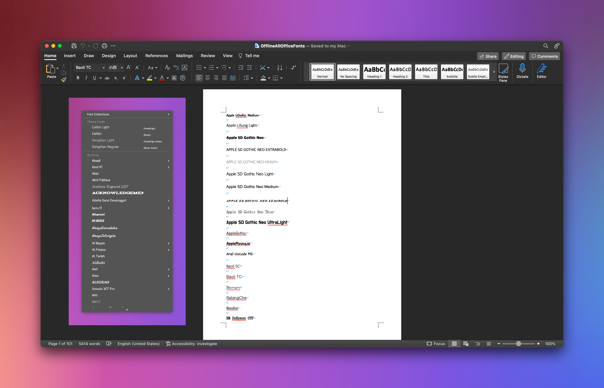

# OfflineAllOfficeFonts
Download all Office suite font offline with once.

Microsoft is very stupid, Office (Word, Excel, Power Point) built-in a large number of fonts but you need to click one by one to download, Microsoft does not provide a one-click offline font method, so I wrote this VB plug-in.

## How to use
Double click `OfflineAllOfficeFonts` to run, Word needs to run Macro.

## License
[MIT](LICENSE)
